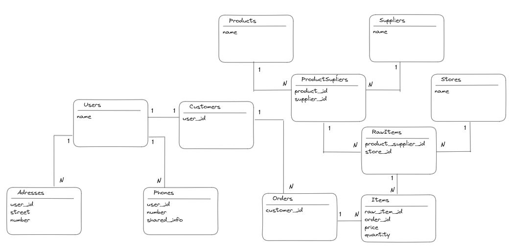

## PUTS DEV - Explorando Banco de dados com Ruby on Rails - 2º laboratório de testes

Puts dev, Querendo montar um pequeno laboratório de testes de banco de dados com Rails?

*A ideia aqui é apenas gerar o banco

Youtube:
https://youtu.be/iNAAgL6iOVw

